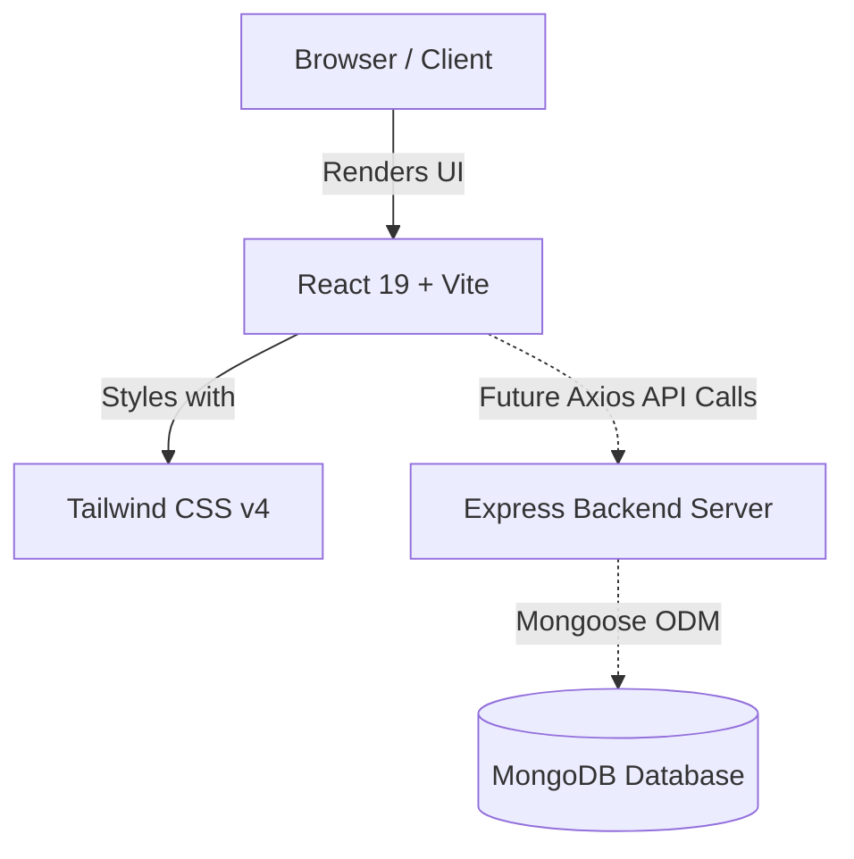

# 🎓 College ERP Dashboard

A beginner-friendly, full-stack **MERN** (MongoDB, Express, React, Node.js) administrative dashboard designed for educational institutions.

---

## 📚 Documentation Hub

Explore the documentation tailored for first-year students and new contributors:

| Guide | Description | Key Focus |
| :--- | :--- | :--- |
| 🚀 [Getting Started](docs/getting-started.md) | Setup & installation guide | Local environment, Vite dev server, npm scripts |
| 🏗️ [Project Architecture](docs/project-architecture.md) | High-level system design | Client-server architecture, data flow, tech stack |
| 📁 [Folder & File Guide](docs/folder-structure.md) | File-by-file breakdown | Purpose, dependencies, common mistakes per file |
| 🧩 [Component Guide](docs/components.md) | React component reference | Props, state, code snippets, beginner pitfalls |
| 🗺️ [Learning Path](docs/learning-path.md) | 7-Day progression plan | Daily checklist, key concepts, visual learning flow |
| 🛠️ [Debugging Guide](docs/debugging.md) | Common errors & solutions | Step-by-step troubleshooting, error fixes |
| ✏️ [Beginner Exercises](docs/exercises.md) | Hands-on practice tasks | Safe exercises with collapsible hints |
| 🎯 [Development Roadmap](docs/roadmap.md) | Logical build sequence | Project status, upcoming milestones, feature plan |

---

## ⚡ Quick Start

### 1. Clone & Setup Client
```bash
# Navigate to client directory
cd client

# Install dependencies
npm install

# Start local development server
npm run dev
```
> The client will run at `http://localhost:5173`.

### 2. Setup Server
```bash
# Navigate to server directory
cd server

# Install dependencies
npm install
```

---

## 🏗️ High-Level System Architecture



---

## 🛠️ Tech Stack Overview

| Area | Technology | Purpose |
| :--- | :--- | :--- |
| **Frontend Framework** | React 19 | Component-based UI rendering |
| **Build Tool** | Vite 8 | Ultra-fast development server & bundler |
| **Styling** | Tailwind CSS v4 | Utility-first responsive CSS styling |
| **Backend** | Node.js + Express 5 | RESTful API web server |
| **Database** | MongoDB + Mongoose 9 | Document database & object modeling |
| **Authentication** | JWT + bcryptjs | Secure user authorization & password hashing |

---

## 📅 What Should I Learn Today?

> [!TIP]
> Check your progress using our interactive daily learning tracker!
> - [ ] **Day 1**: Environment setup & running Vite dev server ([Guide](docs/getting-started.md))
> - [ ] **Day 2**: React JSX & Component basics ([Guide](docs/components.md))
> - [ ] **Day 3**: Props & Layout structure ([Guide](docs/folder-structure.md))
> - [ ] **Day 4**: Tailwind CSS grid & flexbox styling ([Guide](docs/learning-path.md))
> - [ ] **Day 5**: Client-side routing ([Guide](docs/roadmap.md))
> - [ ] **Day 6**: Express API endpoints ([Guide](docs/project-architecture.md))
> - [ ] **Day 7**: Full-stack integration ([Guide](docs/exercises.md))

---

## 🤝 Guidelines 

1. **Kuch bhi kharab ho tension mat lena** — Git lets you undo changes easily!
2. **Agar kabhi error ai to use terminal or browser console pe dekhna or naa samajh ai to ChatGPT se puuchna** before guessing.
3. **Documentation dekh lena sahi se`/docs`** whenever you encounter a new concept or file.

**Or firbhi kuch na ho to puch lena**
